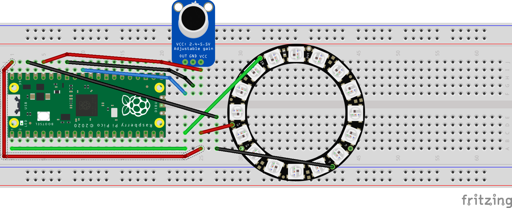

# Voltage 2022S CPW Workshop

Code adapted from [ForsakenNGS's PicoLED library](https://github.com/ForsakenNGS/PicoLED) and [AlexFWulff's pico-playground](https://github.com/AlexFWulff/awulff-pico-playground).

## What does this do?
This code turns your Pi Pico into a crude audio spectrum analyzer.
A microphone should be connect to one of the ADC channels (default channel 0) and a NeoPixel LED strip should be connected to a GPIO pin (default pin 0).
The Pi Pico uses DMA to stream the ADC data into memory, then computes a 512-point, 8-bit fixed point real [Fast Fourier Transform (FFT)](https://en.wikipedia.org/wiki/Fast_Fourier_transform) using the kiss FFT library.
Then, the 256 FFT bins (corresponding to frequencies from 0Hz up to Fsamp/2) are used to modulate the brightness and hue of 16 (or more, configurable through preprocessor define #LED_STRIP_LENGTH) LEDs.
The LEDs are mapped logarithmically to the range of frequencies available between 0Hz and Fsamp/2.
That is, a note which lights up an LED with index `i` played an octave higher would light up LED `i+1`, played two octaves higher would light up LED `i+2`, and so on.
The brightness and color of each LED is determined by the average [Power Spectral Density (PSD)](https://en.wikipedia.org/wiki/Spectral_density) over the frequency range assigned to that LED.
## Setup

### Kit assembly

Connect the microphone and ring of LEDs as shown in the diagram below.

If you're unsure about the location of the pins, check out the pinout for the Raspberry Pi Pico [here](https://www.raspberrypi.com/documentation/microcontrollers/raspberry-pi-pico.html).

|Peripheral Pin | Pi Pico Pin |
|---------------|-------------|
| LED vdd       | 40 (VBUS)   |
| LED gnd       | 38 (GND)    |
| LED input     | 1 (GP0)     |
| mic vdd       | 36 (3V3)    |
| mic gnd       | 33 (GND)    |
| mic output    | 31 (ADC0)   |

### Programming the Pi Pico

For the workshop, I've already preprogrammed all of the microcontrollers. You only need to do this part if you want to modify the code to personalize your device (highly recommended).
Ensure that you've installed the Pi Pico SDK. Follow the guide [here](https://datasheets.raspberrypi.com/pico/getting-started-with-pico.pdf)

These instructions are written for use with Linux. Windows or Mac may need to follow a different procedure (documented in the above guide from the Raspberry Pi website).
Symlink the [PicoLed library](https://github.com/ForsakenNGS/PicoLED) into the repo root
```
$ cd /path/to/repo
$ ln -s /path/to/PicoLed PicoLed
```

Add the lines to your `.bashrc`:
```
export PICO_SDK_PATH=/path/to/pico/pico-sdk
export PICO_EXAMPLES_PATH=/path/to/pico/pico-examples
```
replacing `/path/to/pico` with the path to the directory you installed the sdk in.

### Building a binary
```
$ mkdir build && cd !$
$ cmake ..
$ make
```

### Uploading the binary
If you're using a GUI, you can just drag and drop the `.uf2` file that is generated by `make` into the device under your file browser application.
```
# fdisk -l
...
Device     Boot Start    End Sectors  Size Id Type
/dev/sda1           1 262143  262143  128M  e W95 FAT16 (LBA)
# mount /dev/sda1 /mnt/pico
# pwd
~/voltage-2022s-workshop/build
# cp specan.uf2 /mnt/pico
```

## Extensions / Recommended Modifications
If you’re done tinkering with the spectrum analyzer and want a new challenge, take a look at these ideas.

You could consider adding a beat detector to determine the tempo of the music and flash different colors or flash the LEDs brightly to the beat.
The LEDs already do this somewhat, but you could exaggerate the effect.
See https://www.badlogicgames.com/wordpress/?p=161 for some information on spectral flux and onset detection.

If you are more interested in making sound than analyzing it, you could make your own synthesizer with your Pi Pico. Here are some different sound synthesis techniques for making interesting sounds:
https://blog.landr.com/subtractive-synthesis/
https://cymatics.fm/blogs/production/fm-synthesis
https://www.soundonsound.com/techniques/amplitude-modulation

If you’re looking for a big challenge, you could also create your own pitch detection algorithm. Here are some resources on pitch detection:
http://marsyas.cs.uvic.ca/mirBook/csc475_monophonic_pitch.pdf
http://musicweb.ucsd.edu/~trsmyth/analysis/Harmonic_Product_Spectrum.html
https://www.researchgate.net/publication/281454651_Polyphonic_Pitch_Detection_by_Matching_Spectral_and_Autocorrelation_Peaks
https://sethares.engr.wisc.edu/vocoders/phasevocoder.html

